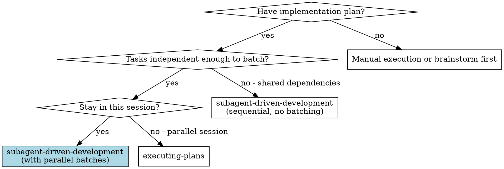
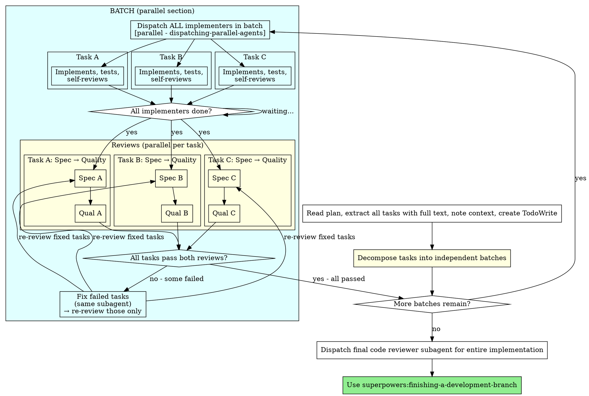

# Subagent-Driven Development

Execute plan by dispatching fresh subagent per task, with two-stage review after each: spec compliance review first, then code quality review.

**Why subagents:** You delegate tasks to specialized agents with isolated context. By precisely crafting their instructions and context, you ensure they stay focused and succeed at their task. They should never inherit your session's context or history — you construct exactly what they need. This also preserves your own context for coordination work.

**Core principle:** Batch independent tasks → parallel dispatch → two-stage review (spec then quality) = high quality, fast iteration

## When to Use



**vs. Executing Plans (parallel session):**
- Same session (no context switch)
- Fresh subagent per task (no context pollution)
- Two-stage review after each task: spec compliance first, then code quality
- Faster iteration (no human-in-loop between tasks)
- **Parallel batching** within a batch for independent tasks

## The Process



## Model Selection

Use the least powerful model that can handle each role to conserve cost and increase speed.

**Mechanical implementation tasks** (isolated functions, clear specs, 1-2 files): use a fast, cheap model. Most implementation tasks are mechanical when the plan is well-specified.

**Integration and judgment tasks** (multi-file coordination, pattern matching, debugging): use a standard model.

**Architecture, design, and review tasks**: use the most capable available model.

**Task complexity signals:**
- Touches 1-2 files with a complete spec → cheap model
- Touches multiple files with integration concerns → standard model
- Requires design judgment or broad codebase understanding → most capable model

## Handling Implementer Status

Implementer subagents report one of four statuses. Handle each appropriately:

**DONE:** Proceed to spec compliance review.

**DONE_WITH_CONCERNS:** The implementer completed the work but flagged doubts. Read the concerns before proceeding. If the concerns are about correctness or scope, address them before review. If they're observations (e.g., "this file is getting large"), note them and proceed to review.

**NEEDS_CONTEXT:** The implementer needs information that wasn't provided. Provide the missing context and re-dispatch.

**BLOCKED:** The implementer cannot complete the task. Assess the blocker:
1. If it's a context problem, provide more context and re-dispatch with the same model
2. If the task requires more reasoning, re-dispatch with a more capable model
3. If the task is too large, break it into smaller pieces
4. If the plan itself is wrong, escalate to the human

**Never** ignore an escalation or force the same model to retry without changes. If the implementer said it's stuck, something needs to change.

## Batching and Parallel Dispatch

Plan tasks are grouped into **independent batches**. Tasks within a batch run their implementation pipelines in parallel using `dispatching-parallel-agents`. Batches run sequentially — batch N+1 starts only after all tasks in batch N pass both reviews.

### Independence Rules

Two tasks belong in the same batch only if ALL are true:

| Check | Criterion |
|---|---|
| **File isolation** | No shared files across Create/Modify/Test paths |
| **No dependency** | Task B doesn't depend on Task A's output (types, functions, data) |
| **No import chain** | Task A's files are not imported by Task B's files (check plan's Architecture section) |
| **Module boundary** | Different subdirectories / modules (e.g., `src/api/` vs `src/lib/`) |

**If uncertain about independence, put tasks in separate batches.** Conservative batching is safer than parallel conflicts.

### Batch Execution

```
1. Decompose plan into batches (check plan's "Files:" sections for independence)
2. For each batch (sequential):
   a. Revalidate independence — earlier batches may have changed dependency shape
   b. [PARALLEL] Dispatch ALL implementer subagents simultaneously
   c. Implementers report exact files created/modified (for scoped review)
   d. [PARALLEL] Dispatch spec reviewers for ALL tasks simultaneously
   e. Wait for all spec reviews
   f. For each task:
      - If spec ✅ → [PARALLEL] dispatch quality reviewer (across all passed tasks)
      - If spec ❌ → implementer fixes → re-review spec → THEN quality
   g. Wait for all quality reviews
   h. If any task failed either review:
      - Fix only the failed tasks (same subagent)
      - Check if fix touches files/APIs used by passing tasks → invalidate those too
      - Re-review only affected tasks
   i. Once all tasks in batch pass both reviews → controller commits, then next batch
3. Final code review across entire implementation
4. Finish branch
```

### Batch Size

| Tasks in batch | When |
|---|---|
| 1 | Tasks share files or dependencies — sequential only |
| 2-3 | Sweet spot. Most common for well-decomposed plans |
| 4+ | Rare. Only if tasks are truly isolated (e.g., unrelated microservices) |

**Max batch size: 3.** Beyond 3, coordination overhead outweighs parallel speedup.

### Quality Review Gate

Quality reviewers run ONLY for tasks that passed spec compliance. Never pre-dispatch quality reviews for tasks whose spec review is still pending or failed.

```
After all spec reviews complete:
  For each task:
    - If spec ✅ → dispatch quality reviewer
    - If spec ❌ → implementer fixes → re-review spec → THEN quality
```

The example workflow in this skill shows Quality reviewer 2 as "waiting" — that informal wait must be a HARD GATE. Do not dispatch quality reviewers until spec is clean for that specific task.

### Failure Handling

- **Passing tasks** in a failed batch are NOT rolled back. Their code stays in place.
- **Failing tasks** enter the fix loop: same implementer subagent → fix → re-review. Only the failing task is blocked.
- **Invalidation:** If a failed-task fix touches files, imports, generated outputs, tests, or public APIs used by a passed task, re-review affected passed tasks. The independence assumption may have been wrong.
- A batch completes only when ALL its tasks pass both reviews. But passing tasks are already done — they just wait for stragglers.

### Per-Task Review Boundaries

Implementer subagents MUST report exact files created/modified. Each reviewer reviews only that task's diff — not the entire branch. This prevents:
- Reviewers evaluating code from other parallel tasks
- False positives from unrelated changes
- Blamed-at-the-wrong-task confusion during re-review loops

### Revalidate Batches Between Runs

Independence is checked at the start, but earlier implementations can change dependency shape (e.g., Task A exports a new type that Task B's batch-mate now imports). **Revalidate batch independence before starting each new batch.** If the dependency graph changed, restructure remaining batches.

### When NOT to Batch

- Tasks that modify the same file (even different sections)
- Tasks where Task B's implementation references types/functions from Task A
- Tasks that cross module boundaries into the same shared utility (risk of import conflicts)
- Tasks that touch shared mutable infrastructure: `package.json`, lockfiles, migrations, schemas, snapshots, barrel exports, route registries, test fixtures, database seeds, or global test resources
- If you can't determine independence with 90% confidence — don't batch

## Prompt Templates

- `./implementer-prompt.md` - Dispatch implementer subagent
- `./spec-reviewer-prompt.md` - Dispatch spec compliance reviewer subagent
- `./code-quality-reviewer-prompt.md` - Dispatch code quality reviewer subagent

## Example Workflow

```
You: I'm using Subagent-Driven Development to execute this plan.

[Read plan file once: docs/plans/feature-plan.md]
[Extract all 5 tasks with full text and context]
[Create TodoWrite with all tasks]

--- BATCHING ---

[Analyze independence: Task 1 (src/api/users.ts) and Task 2 (src/lib/format.ts)
 touch different modules. Task 3 depends on Task 1's types. Tasks 4,5 share
 a file. Batches:
  Batch A: Task 1 + Task 2   ← independent, parallel-safe
  Batch B: Task 3             ← depends on Task 1 (sequential)
  Batch C: Task 4 + Task 5   ← share a file (actually NOT independent —
                                move Task 5 to its own batch)]

--- BATCH A: Task 1 + Task 2 (parallel) ---

[Dispatch both implementers simultaneously via dispatching-parallel-agents]
  → Impl 1: "Implementing user CRUD..."
  → Impl 2: "Implementing format utilities..."

[Later] Implementer 1:
  - Created users.ts with create/get/update/delete
  - Tests passing, 12/12
  - Self-review: all good

Implementer 2:
  - Created format.ts with date/number/string formatters
  - Tests passing, 8/8
  - Self-review: good coverage

[Dispatch both spec reviewers in parallel]
Spec reviewer 1: ✅ Spec compliant
Spec reviewer 2: ❌ Missing: locale param for date formatting

[Dispatch both quality reviewers in parallel]
Quality reviewer 1: ✅ Clean, solid
Quality reviewer 2: (waiting — spec not clean yet)

[Fix Task 2 spec gap via same implementer subagent]
Implementer 2: Added locale param, updated tests

[Re-review Task 2]
Spec reviewer 2: ✅ Spec compliant now
Quality reviewer 2: ✅ Approved

[Mark Task 1 complete, Task 2 complete]
[Controller commits: git add -A && git commit -m "feat: add user CRUD and format utilities"]

--- BATCH B: Task 3 (sequential — depends on Task 1) ---

[Dispatch implementer]
Implementer 3: "Task 3 builds on User type from Task 1. Implementing..."
[Implements, spec review, quality review — all clean]
[Controller commits: git commit -m "feat: add user export with formatting"]
[Mark Task 3 complete]

--- BATCH C: Task 4 only (Task 5 in own batch) ---

[... sequential through remaining tasks ...]

--- ALL BATCHES DONE ---

[Dispatch final code reviewer]
Final reviewer: All requirements met, solid implementation, ready to merge

Done!
```

## Advantages

**vs. Manual execution:**
- Subagents follow TDD naturally
- Fresh context per task (no confusion)
- Parallel-safe (subagents don't interfere)
- Subagent can ask questions (before AND during work)

**vs. Executing Plans:**
- Same session (no handoff)
- Continuous progress (no waiting)
- Review checkpoints automatic
- **Parallel batching** for independent tasks

**Efficiency gains:**
- No file reading overhead (controller provides full text)
- Controller curates exactly what context is needed
- Subagent gets complete information upfront
- Questions surfaced before work begins (not after)

**Quality gates:**
- Self-review catches issues before handoff
- Two-stage review: spec compliance, then code quality
- Review loops ensure fixes actually work
- Spec compliance prevents over/under-building
- Code quality ensures implementation is well-built

**Cost:**
- More subagent invocations (implementer + 2 reviewers per task)
- Controller does more prep work (extracting all tasks upfront)
- Review loops add iterations
- But catches issues early (cheaper than debugging later)

## Red Flags

**Never:**
- Start implementation on main/master branch without explicit user consent
- Skip reviews (spec compliance OR code quality)
- Proceed with unfixed issues
- Dispatch multiple implementation subagents in parallel WITHOUT verifying they're in independent batches
- Put tasks in the same batch when they share files, imports, or dependencies
- Let implementer subagents commit (commits happen exclusively at the controller level after reviews pass)
- Dispatch quality reviewers for tasks whose spec review is still pending or failed
- Skip revalidating batch independence after earlier batches complete (dependency shape may shift)
- Make subagent read plan file (provide full text instead)
- Skip scene-setting context (subagent needs to understand where task fits)
- Ignore subagent questions (answer before letting them proceed)
- Accept "close enough" on spec compliance (spec reviewer found issues = not done)
- Skip review loops (reviewer found issues = implementer fixes = review again)
- Let implementer self-review replace actual review (both are needed)
- **Start code quality review before spec compliance is ✅** (wrong order)
- Move to next batch while any task in current batch has open review issues
- Mix passing and failing batch results — all must pass before batch advances

**If subagent asks questions:**
- Answer clearly and completely
- Provide additional context if needed
- Don't rush them into implementation

**If reviewer finds issues:**
- Implementer (same subagent) fixes them
- Reviewer reviews again
- Repeat until approved
- Don't skip the re-review

**If subagent fails task:**
- Dispatch fix subagent with specific instructions
- Don't try to fix manually (context pollution)

## Integration

**Required workflow skills:**
- **dispatching-parallel-agents** - REQUIRED: Dispatch independent tasks in a batch in parallel
- **superpowers:writing-plans** - Creates the plan this skill executes
- **superpowers:requesting-code-review** - Code review template for reviewer subagents
- **superpowers:finishing-a-development-branch** - Complete development after all tasks

**Subagents should use:**
- **superpowers:test-driven-development** - Subagents follow TDD for each task

**Alternative workflow:**
- **superpowers:executing-plans** - Use for parallel session instead of same-session execution
