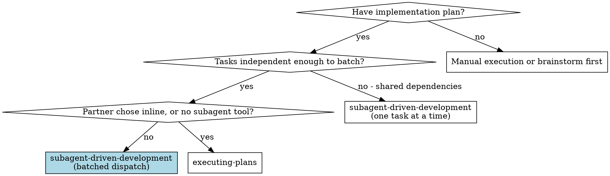
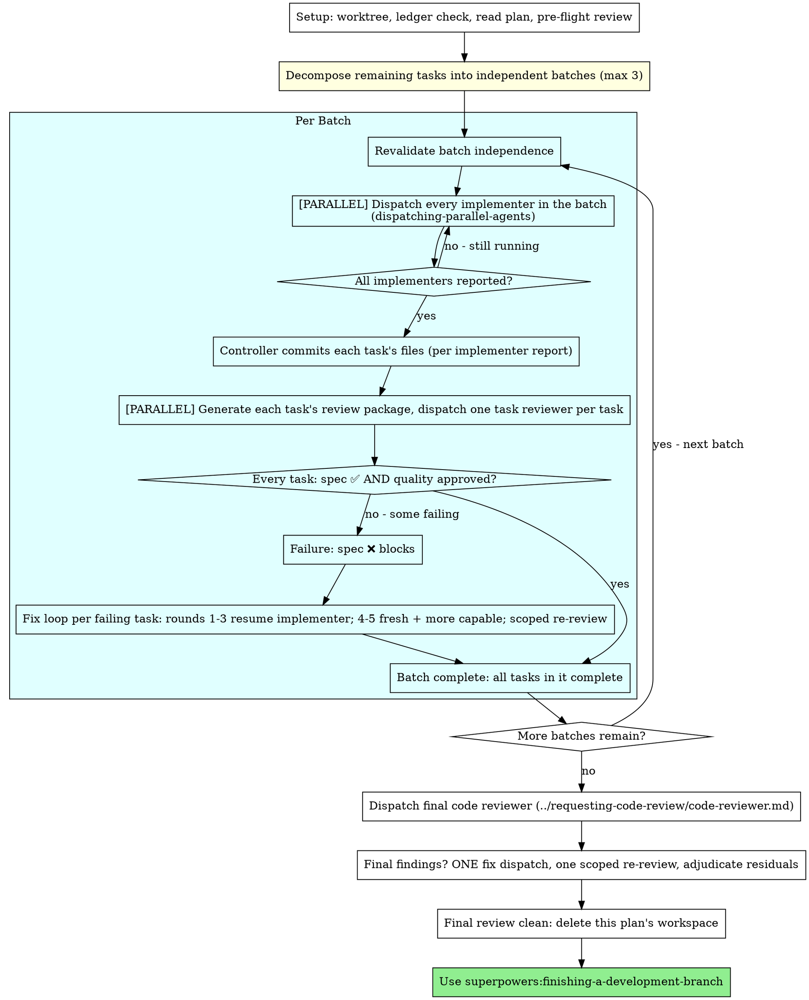

# Subagent-Driven Development

Execute plan by dispatching fresh implementer subagents — batched in parallel
where the plan's tasks are independent — with a task review (spec compliance +
code quality) after each task, and a broad whole-branch review at the end.

**Why subagents:** You delegate tasks to specialized agents with isolated context. By precisely crafting their instructions and context, you ensure they stay focused and succeed at their task. They should never inherit your session's context or history — you construct exactly what they need. This also preserves your own context for coordination work.

**Core principle:** Independent tasks in batches of up to 3 → parallel
dispatch → per-task task review (spec + quality) → broad final review = high
quality, fast iteration

**Narration:** between tool calls, narrate at most one short line — the
ledger and the tool results carry the record.

**Continuous execution:** Do not pause to check in with your human partner between tasks. Execute all tasks from the plan without stopping. The only reasons to stop are the four named below, or all tasks complete. "Should I continue?" prompts and progress summaries waste their time — they asked you to execute the plan, so execute it.

**Rulings, not stalls.** A running plan does not wait on a human. Conflicts,
ambiguities, plan defects, a cap you would have asked to exceed — decide
them. The spec is the binding authority, the plan is its argument, and your
judgment settles what neither answers. Record every decision in the ledger as
`Ruling: <what you decided> — <why> — <what it costs if wrong>`, and keep
going. A wrong ruling costs rework your human partner can see and undo; a
session parked on a question costs their whole day and buys nothing.

Four things stop you, and only these: an irreversible or destructive
operation; a security-sensitive action; a side effect outside this worktree
that norms say you ask about first (a merge, a push to a shared branch, a
publish); and a plan so broken that every path forward is a guess. For those,
stop and ask.

## When to Use



**vs. Executing Plans (inline):**
- Fresh subagent per task (no context pollution) instead of one context doing every task
- Review after each task (spec compliance + code quality) instead of only at the end
- Costs a fresh context per task and per review; inline costs one context plus one final reviewer
- Both run in this session, share the same plan workspace and ledger, and never pause between tasks

## The Process



Batches run sequentially; tasks inside a batch run in parallel. A batch is
the unit of failure handling and of ledger bookkeeping.

## Setup

Ensure the work happens in an isolated workspace: create a git worktree
(or verify the existing one) with your worktree workflow before starting.
Never start implementation on a main/master branch without your human
partner's explicit consent.

Conversation memory does not survive compaction. In real sessions,
controllers that lost their place have re-dispatched entire completed task
sequences — the single most expensive failure observed. Track progress in
a ledger file, not only in todos.

- Each plan owns a workspace: at skill start, run this skill's
  `bash scripts/sdd-workspace PLAN_FILE` — it prints the plan's git-ignored
  directory (under `<repo-root>/.superpowers/sdd/`), home to
  every artifact for THIS plan: ledger, briefs, reports, review packages.
  Another plan's directory is never yours to read or write.
- Check for this plan's ledger at `<workspace>/progress.md`. If its first
  line names your plan file, tasks with a `Task <N>: complete` line are DONE
  — do not re-dispatch them; resume at the first task without one. A task
  whose last line is a fix round is mid-loop: resume the loop at the next
  round. Record the batch a task belongs to on its first ledger line, so a
  resumed controller reconstructs the same batches. A ledger whose first line
  names a different plan file — or a stray ledger at the old flat path
  `.superpowers/sdd/progress.md` — is another plan's progress: leave it in
  place and start your own, fresh.
- Create the ledger with its identity as the first line:
  `# SDD ledger — plan: <plan file path>`.
- The ledger is your recovery map: the commits it names exist in git even
  when your context no longer remembers creating them. After compaction,
  trust the ledger and `git log` over your own recollection.
- `git clean -fdx` will destroy the workspace (it's git-ignored scratch); if
  that happens, recover from `git log`.

Read the plan once, note its context and Global Constraints, and create a
todo per task. If the plan names a Spec, read that too: the spec is the
authority the plan argues from, and conflicts inside the plan resolve
against it. A plan with no reachable spec gets a ledger note saying so —
rulings made without one are provisional.

Before dispatching the first batch, scan the plan once for conflicts, writing
down what you checked as you check it:

- tasks that contradict each other or the plan's Global Constraints
- anything the plan explicitly mandates that the review rubric treats as a
  defect (a test that asserts nothing, verbatim duplication of a logic block)

The scan's output is a table, not a verdict. One row for every pair of tasks
that share a file or an interface: the two tasks, what one produces against
what the other consumes, and what you found. One row for every task: whether
its own text agrees with itself — the tests it specifies against the code it
specifies, the files it creates against the files it later touches. "The scan
is clean" without those rows is not a scan you ran.

The same scan produces the batches: a pair of tasks that shares a file or an
interface in the table can never share a batch. Record the batch
decomposition in the ledger beside the table, one line per batch
(`Batch A: Tasks 1, 2 — independent: src/api/ vs src/lib/`), then revalidate
it before each batch starts.

Write the table to the ledger. Rule on everything you find before execution
begins — each finding against the plan text that mandates it — and record
each ruling in the ledger. If the scan is clean, proceed without comment.
Rule on each conflict it surfaces — the spec is the binding authority, the
plan is its argument — record the ruling beside its row, and dispatch the
first batch. The review loop remains the net for conflicts that only emerge
from implementation.

## Model Selection

Use the least powerful model that can handle each role to conserve cost and increase speed.

**Mechanical implementation tasks** (isolated functions, clear specs, 1-2 files): use a fast, cheap model. Most implementation tasks are mechanical when the plan is well-specified.

**Integration and judgment tasks** (multi-file coordination, pattern matching, debugging): use a standard model.

**Architecture and design tasks**: use the most capable available model.
The final whole-branch review is one of these — dispatch it on the most
capable available model, not the session default.

**Review tasks**: choose the model with the same judgment, scaled to the
diff's size, complexity, and risk. A small mechanical diff does not need the
most capable model; a subtle concurrency change does. Scoped re-reviews of
small fix diffs take a cheap-to-mid tier.

**Fix-loop escalation (rounds 4-5)**: use a model at least one tier above
the implementer that got stuck.

**Always specify the model explicitly when dispatching a subagent.** An
omitted model inherits your session's model — often the most capable and
most expensive — which silently defeats this section.

**Turn count beats token price.** Wall-clock and context cost scale with how
many turns a subagent takes, and the cheapest models routinely take 2-3× the
turns on multi-step work — costing more overall. Use a mid-tier model as
the floor for reviewers and for implementers working from prose descriptions.
When the task's plan text contains the complete code to write, the
implementation is transcription plus testing: use the cheapest tier for
that implementer. Single-file mechanical fixes also take the cheapest tier.

**Task complexity signals (implementation tasks):**
- Touches 1-2 files with a complete spec → cheap model
- Touches multiple files with integration concerns → standard model
- Requires design judgment or broad codebase understanding → most capable model

## Batching and Parallel Dispatch

Plan tasks are grouped into **independent batches**. Tasks within a batch run
their implementation pipelines in parallel using
`dispatching-parallel-agents`. Batches run sequentially — batch N+1 starts
only after **every** task in batch N has completed its task review.

A batch is the unit of parallelism, failure handling, and controller
commits. Nothing crosses a batch boundary until the whole batch is clean.

### Independence Rules

Two tasks belong in the same batch only if ALL are true:

| Check | Criterion |
|---|---|
| **File isolation** | No shared files across Create/Modify/Test paths |
| **No dependency** | Task B doesn't depend on Task A's output (types, functions, data) |
| **No import chain** | Task A's files are not imported by Task B's files (check plan's Architecture section) |
| **Module boundary** | Different subdirectories / modules (e.g., `src/api/` vs `src/lib/`) |

**If uncertain about independence, put tasks in separate batches.** Conservative
batching is safer than parallel conflicts. Parallel dispatch is permitted
*only* under these rules — never dispatch dependent tasks together.

### Batch Size

| Tasks in batch | When |
|---|---|
| 1 | Tasks share files or dependencies — sequential only |
| 2-3 | Sweet spot. Most common for well-decomposed plans |
| 4+ | **Forbidden.** Never dispatch more than 3 implementers at once |

**Max batch size: 3.** Beyond 3, coordination overhead outweighs parallel
speedup, and the controller loses track of which working-tree change belongs
to which task.

### Batch Execution

```
1. Decompose plan into batches (check plan's "Files:" sections for independence)
2. For each batch (sequential):
   a. Revalidate independence — earlier batches may have changed dependency shape
   b. [PARALLEL] Dispatch ALL implementer subagents in the batch simultaneously
   c. Each implementer reports exact file paths created/modified (for scoped
      review AND for the controller's per-task commit)
   d. [PARALLEL] For every task in the batch: generate its review package and
      dispatch one task reviewer (spec + quality, single reviewer, both verdicts)
   e. For each task, adjudicate its two verdicts (see Quality Review Gate)
   f. Fix loops run per failing task; passing tasks are not re-reviewed
   g. Controller commits each passing task's files, per that task's report
   h. Once every task in the batch is complete → next batch
3. Final code review across entire implementation
4. Finish branch
```

### Quality Review Gate

Each task gets **one** task-reviewer dispatch that issues **both** verdicts:
spec compliance and code quality (see [task-reviewer-prompt.md](task-reviewer-prompt.md)).
The two verdicts are not two seats and not two stages — one reviewer reads the
task's diff once and returns both.

**Both must pass before a task counts done or the batch advances.**

**A spec verdict failure blocks regardless of the quality verdict.** A task
with `Spec ✅` and `Task quality: Needs fixes` does not advance. A task with
`Spec ❌` and `Task quality: Approved` does not advance either — clean code
that is the wrong code is still not done. The fix loop covers both verdicts:
Critical/Important quality findings and spec gaps enter it identically.

Only after a task's spec verdict is ✅ and its quality verdict is Approved
does the controller commit that task's files.

### Revalidate Batches Between Batches

Independence is checked at the start, but earlier implementations can change
dependency shape (e.g., Task A exports a new type that Task B now imports).
**Revalidate batch independence before starting each new batch.** If the
dependency graph changed, restructure the remaining batches and ledger the
new decomposition. Never carry a batch forward on the pre-flight scan alone.

### Per-Task Review Boundaries

Implementer subagents MUST report exact file paths created/modified. Each
reviewer reviews only that task's diff — not the entire batch, not the entire
branch. This prevents:
- Reviewers evaluating code from other tasks in the same batch
- False positives from unrelated changes
- Blamed-at-the-wrong-task confusion during re-review loops

### Batch Failure Handling

- **Passing tasks** in a failed batch are NOT rolled back. Their code stays in
  place and their reviews stand.
- **Failing tasks** enter the fix loop individually: same implementer
  subagent → fix → scoped re-review. Only the failing task is blocked.
- **Fix loops are scoped per task.** The five-round breaker is per task, not
  per batch.
- **Invalidation:** If a failing task's fix touches files, imports, generated
  outputs, tests, or public APIs used by a *passing* task in the same batch,
  that passing task is invalidated and re-reviewed too. The independence
  assumption may have been wrong.
- **The ledger stays honest:** the batch is not complete while any of its
  tasks has open Critical/Important findings or a spec gap. Passing tasks
  wait for stragglers; they are never marked complete early.
- **Commits happen per task, only on a clean verdict.** A task that is still
  in its fix loop has nothing committed for it yet.

### When NOT to Batch

- Tasks that modify the same file (even different sections)
- Tasks where Task B's implementation references types/functions from Task A
- Tasks that cross module boundaries into the same shared utility (risk of
  import conflicts)
- Tasks that touch shared mutable infrastructure: `package.json`, lockfiles,
  migrations, schemas, snapshots, barrel exports, route registries, test
  fixtures, database seeds, or global test resources
- Four or more tasks in one group — split them across batches
- If you can't determine independence with 90% confidence — don't batch

## The Task Loop

**Batch small same-shape work.** When the plan lists several tasks that are
each a small, independent edit of the same kind — the same one-line fix,
constant change, or field addition repeated across files — do not dispatch
one subagent per task. Compose ONE dispatch brief listing every file and
its change, send the whole batch to a single subagent, and review its diff
as one unit. Reserve one-dispatch-per-task for work that needs its own
judgment, its own tests, or its own review surface.

Everything you paste into a dispatch prompt — and everything a subagent
prints back — stays resident in your context for the rest of the session
and is re-read on every later turn. Hand artifacts over as files.

**Waiting on dispatched subagents:** never poll a wait interface with
short timeouts, and never sit in one silent, open-ended wait either.
While you have local work — ledger updates, packaging the next review,
reading reports — keep working; child results arrive on their own.
When you are genuinely idle, wait in bounded stretches (five to ten
minutes, where your platform allows), and between stretches post one
line of status and reconcile your live children: list them, and chase
any that finished without reporting. A bounded stretch keeps nearly
all of a long wait's efficiency while guaranteeing a stuck or lost
child is noticed within minutes, not at the end of the session.

### 1. Dispatch the implementer(s)

Dispatch every implementer in the batch together, using
`dispatching-parallel-agents`. Record BASE (`git rev-parse HEAD`) before the
batch — the review packages and fix-round diffs need it.

- **Task brief:** before dispatching an implementer, run this skill's
  `bash scripts/task-brief PLAN_FILE N` — it extracts the task's full text to a
  uniquely named file and prints the path. Compose the dispatch so the
  brief stays the single source of
  requirements. Your dispatch should contain: (1) one line on where this
  task fits in the project; (2) the brief path, introduced as "read this
  first — it is your requirements, with the exact values to use verbatim";
  (3) interfaces and decisions from earlier tasks that the brief cannot
  know; (4) your resolution of any ambiguity you noticed in the brief;
  (5) the report-file path and report contract. Exact values (numbers,
  magic strings, signatures, test cases) appear only in the brief. Never
  make a subagent read the whole plan file.
- **Report file:** name the implementer's report file after the brief
  (brief `…/task-N-brief.md` → report `…/task-N-report.md`) and put it in
  the dispatch prompt. The implementer writes the full report there and
  returns only status, the exact file paths created/modified, a one-line
  test summary, and concerns. **The controller needs those paths to commit
  and scope the review** — a report without them cannot be turned into a
  review package.
- **State the file-isolation contract.** A batch-mate is editing the same
  working tree right now. Tell the implementer: touch only the files your
  brief names; do not run repo-wide formatters, dependency installs,
  lockfile updates, or whole-suite migrations; leave every other task's
  files alone even if you see them changing.
- A dispatch prompt describes one task, not the session's history. Do not
  paste accumulated prior-task summaries ("state after Tasks 1-3") into
  later dispatches — a real session's dispatch hit 42k chars of which 99%
  was pasted history. A fresh subagent needs its task, the interfaces it
  touches, and the global constraints. Nothing else.
- The dispatch carries the no-subagents contract (it is in the
  implementer template): the implementer never dispatches subagents —
  not helpers, and never a reviewer. Review arrives from you, after the
  report. In real sessions, every reviewer a worker spawned duplicated
  the task review the controller dispatched anyway — a full extra
  review seat per task.
- The dispatch carries the no-commit contract: implementers never commit.
  The controller commits, per task, after that task's review is clean.
- If an earlier task parked a finding in the area this task touches, carry
  a pointer to that ledger entry in the dispatch.
- Record each implementer's agent identity from the dispatch result —
  fix-loop rounds 1-3 resume that agent.
- Dispatch multiple implementers in parallel only when they are in the same
  validated batch. Never dispatch dependent tasks together, and never
  dispatch more than 3 at once.

Template: [implementer-prompt.md](implementer-prompt.md)

### 2. Handle the report

Implementer subagents report one of four statuses. Handle each appropriately:

**DONE:** Take the exact file paths from the report and commit them yourself
(`git add <those paths>` and commit — see *Controller-Owned Commits* below).
Then generate the review package (`bash scripts/review-package PLAN_FILE BASE HEAD`, from this skill's directory — it prints the unique file path it wrote; BASE is the commit you recorded before the batch — never `HEAD~1`, which silently drops all but the last commit of a multi-commit task), then dispatch the task reviewer with the printed path.

**DONE_WITH_CONCERNS:** The implementer completed the work but flagged doubts. Read the concerns before proceeding. If the concerns are about correctness or scope, address them before review. If they're observations (e.g., "this file is getting large"), note them and proceed to review.

**NEEDS_CONTEXT:** The implementer needs information that wasn't provided. Provide the missing context and re-dispatch.

**BLOCKED:** The implementer cannot complete the task. Assess the blocker:
1. If it's a context problem, provide more context and re-dispatch with the same model
2. If the task requires more reasoning, re-dispatch with a more capable model
3. If the task is too large, break it into smaller pieces
4. If the plan itself is wrong, rule on the correction, ledger it, and re-dispatch with the ruling carried in the dispatch

**Never** ignore an escalation or force the same model to retry without changes. If the implementer said it's stuck, something needs to change.

A BLOCKED or NEEDS_CONTEXT task does not stop its batch-mates — those keep
going and get reviewed. The batch simply cannot complete until the blocked
task is resolved.

If the implementer asks questions — before starting or mid-task — answer
clearly and completely, provide additional context if needed, and don't
rush it into implementation.

### Controller-Owned Commits

**Implementers never commit. You do.**

For each task, after the implementer reports DONE and before you generate its
review package, commit exactly the paths that implementer's report named:

```
git add <the exact file paths from the implementer's report>
git commit -m "task <N>: <task name> (under review)"
```

Rules that make this safe inside a batch:

- `git add` the **reported paths only**. A batch-mate's files are in the same
  working tree and are not yours to stage. If a report's paths are
  implausibly broad for its brief, narrow them or ask — never `git add -A`.
- Never `git commit -a`, and never a repo-wide formatter or codemod as part
  of a task commit: it would sweep in a batch-mate's in-flight work.
- One commit per task, at the task's own scope. A fix round adds one more
  commit on top, so `BASE..HEAD` for a task is exactly its own work.
- The commit is what makes the diff reviewable — the review package reads a
  commit range. That is why it happens before review, not after.
- Fix rounds are committed the same way, from the resumed implementer's
  report, so the scoped re-review has a range to read.

Why the controller owns commits: in a batch, several implementers work one
working tree. Commits are a serialization point, and the controller is the
only party that knows which paths belong to which task. It also keeps a
task's history readable: the controller is the one who can name the task.

### 3. Review the task

Per-task reviews are task-scoped gates. The broad review happens once, at the
final whole-branch review. Never skip the task review, and never accept a
report missing either verdict — spec compliance AND task quality are both
required. Implementer self-review never replaces the task review; both are
needed.

- Hand the reviewer its diff as a file: run this skill's
  `bash scripts/review-package PLAN_FILE BASE HEAD` and pass the reviewer the file path
  it prints (or, without bash: `git log --oneline`, `git diff --stat`,
  and `git diff -U10` for the range, redirected to one uniquely named
  file). The output never enters your own context, and the reviewer sees
  the commit list, stat summary, and full diff with context in one Read
  call. Use the BASE you recorded before the batch —
  never `HEAD~1`, which silently truncates multi-commit tasks. Never
  dispatch a task reviewer without a diff file.
- One task reviewer per task, dispatched in parallel across the batch. The
  reviewer returns BOTH verdicts (spec compliance and code quality) in a
  single report; you are not dispatching a spec reviewer and a quality
  reviewer.
- **Reviewer inputs:** the task reviewer gets three paths — the same brief
  file, the report file, and the review package — plus the global
  constraints that bind the task.
- The global-constraints block you hand the reviewer is its attention
  lens. Copy the binding requirements verbatim from the plan's Global
  Constraints section or the spec: exact values, exact formats, and the
  stated relationships between components ("same layout as X", "matches
  Y"). The reviewer's template already carries the process rules (YAGNI,
  test hygiene, review method) — the constraints block is for what THIS
  project's spec demands.
- Do not add open-ended directives like "check all uses" or "run race tests
  if useful" without a concrete, task-specific reason
- Do not ask a reviewer to re-run tests the implementer already ran on the
  same code — the implementer's report carries the test evidence
- Do not pre-judge findings for the reviewer — never instruct a reviewer to
  ignore or not flag a specific issue. If you believe a finding would be a
  false positive, let the reviewer raise it and adjudicate it in the review
  loop. If the prompt you are writing contains "do not flag," "don't treat X
  as a defect," "at most Minor," or "the plan chose" — stop: you are
  pre-judging, usually to spare yourself a review loop.
The task reviewer may report "⚠️ Cannot verify from diff" items — requirements
that live in unchanged code or span tasks. These do not block the rest of the
review, but you must resolve each one yourself before marking the task
complete: you hold the plan and cross-task context the reviewer
lacks. If you confirm an item is a real gap, treat it as a failed spec
review — it enters the fix loop with the other findings.

Template: [task-reviewer-prompt.md](task-reviewer-prompt.md)

### 4. The fix loop

The loop triggers when the review reports spec ❌, any Critical or Important
finding, or a ⚠️ item you confirmed as a real gap. **In a batch, the loop is
per task** — a failing task's loop never re-reviews or re-dispatches its
passing batch-mates (unless a fix invalidates them; see Batch Failure
Handling).

Before the loop starts, two routes leave it immediately:

- Record Minor findings in the progress ledger as you go
  (`Task <N>: minor (deferred): <one-liner>`), and point the final
  whole-branch review at that list so it can triage which must be fixed
  before merge. A roll-up nobody reads is a silent discard. Minor findings
  never enter the loop.
- A finding labeled plan-mandated — or any finding that conflicts with
  what the plan's text requires — is yours to rule on: weigh the finding
  against the plan text, decide with the spec as the binding authority, and
  ledger the ruling before you act on it. Do not dismiss the finding because
  the plan mandates it, and do not dispatch a fix that contradicts the plan
  without a recorded ruling.
Everything else enters the loop. A fix round is one fix dispatch plus one
scoped re-review. Five rounds maximum per task:

**Rounds 1-3 — resume the original implementer.** Send it the open findings
verbatim. Its context is intact: it knows the task, the code, and its own
choices. If your harness cannot send another message to a live subagent,
dispatch a fresh implementer carrying the brief path, the report-file path,
and the findings — the report file is the persistent memory either way.
A resumed implementer is one of several batch-mates: it edits only its own
task's files.

**Rounds 4-5 — dispatch a fresh implementer on a more capable model** (per
Model Selection), with the brief path, the report-file path, the open
findings, and this framing: "A prior implementer attempted this task
[N] times; you own it now. Read the report file for what was tried." A loop
that survives three resumes usually means the implementer cannot see its
own problem — fresh eyes and a capability bump in one move.

**Every round, either way:** the implementer fixes, re-runs the tests
covering the amended code, appends its fix report to the same report file,
and returns the short contract. Before re-dispatching the reviewer, confirm
the fix report contains the covering tests, the command run, and the
output; dispatch the re-review once all three are present. Name the
covering test files in the fix message — a one-line fix does not need the
whole suite. Then commit the fixed paths (controller-owned commits, same as
the first pass) so the re-review has a range.

**The re-review is scoped.** Run `bash scripts/review-package PLAN_FILE FIX_BASE HEAD`
where FIX_BASE is the head the previous review saw, and dispatch
[re-review-prompt.md](re-review-prompt.md) with the findings list, the
brief, the report file, and the printed diff path. The re-reviewer verdicts
each finding ADDRESSED or NOT ADDRESSED and flags new breakage in the fix
diff only. New Critical/Important breakage in the fix diff joins the open
findings list. Out-of-scope observations go to the ledger as deferred
minors — they never extend the loop.

**After each round,** append to the ledger:
`Task <N>: fix round <R>/5 (<X> addressed, <Y> open — <finding one-liners>; commits <a7>..<b7>)`

Never fix findings yourself in the controller session — your context stays
clean for coordination, and controller fixes skip review.

**The breaker.** When round 5's re-review still leaves findings open, stop
dispatching. Adjudicate each open finding yourself — you hold the plan and
the cross-task context the reviewer lacks:

- **The reviewer is wrong, or the point is contestable:** park it —
  `Task <N>: parked — <finding> — Ruling: <why the code stands>`. The final
  review sees both sides.
- **Real, but nothing downstream builds on it:** park it the same way, with
  a ruling that says it's real and deferred.
- **Real and load-bearing** — a later task builds on it, or it reveals a
  plan defect: rule on the smallest change that unblocks the dependent work,
  ledger it as `Task <N>: Ruling: <finding> — <what you decided and why>`,
  and carry it into the next task's dispatch. Parking a structural failure
  silently lets every dependent task build on it. Stop only when the defect
  leaves every path forward a guess.

Adjudicate only at the cap. Adjudicating earlier to end a loop is
pre-judging with a different name. Every adjudication is a ledger entry —
a silent discard is forbidden.

### 5. Complete the task

A task completes when its review is clean — spec ✅ **and** task quality
Approved, no open Critical/Important, every ⚠️ resolved, or every open
finding parked with a ruling at the cap. **A spec failure blocks the task
even when the quality verdict is Approved.** The task's work is already
committed (Controller-Owned Commits); nothing extra to commit at
completion. Append the completion line to the ledger in the same message as
your other bookkeeping:

- `Task <N>: complete (commits <base7>..<head7>, review clean)`
- `Task <N>: complete (commits <base7>..<head7>, <K> parked)` after a
  tripped breaker

Then mark the todo complete. Never mark a task complete while its review has
open Critical/Important issues or a spec gap that are neither fixed nor
parked-with-ruling at the cap — and never advance the batch while any of its
tasks is incomplete.

## Final Review

The final whole-branch review gets a package too: run
`bash scripts/review-package PLAN_FILE MERGE_BASE HEAD` (MERGE_BASE = the commit the
branch started from, e.g. `git merge-base main HEAD`) and include the
printed path in the final review dispatch, so the final reviewer reads
one file instead of re-deriving the branch diff with git commands. Dispatch
on the most capable available model (see Model Selection), using
superpowers:requesting-code-review's
[code-reviewer.md](../requesting-code-review/code-reviewer.md). Point it at
the ledger's deferred-minor and parked lines so it can triage which must be
fixed before merge.

If the final whole-branch review returns findings, dispatch ONE fix subagent
with the complete findings list — not one fixer per finding.
Per-finding fixers each rebuild context and re-run suites; a real
session's final-review fix wave cost more than all its tasks combined.
Then run exactly one scoped re-review of the fix wave
(`bash scripts/review-package PLAN_FILE FIX_BASE HEAD` over the fix range,
[re-review-prompt.md](re-review-prompt.md)).
Adjudicate any residual findings as in the task loop's breaker: park with
rulings, or rule on the load-bearing ones and ledger what you decided. Only
the four classes above stop you here. There is no second fix wave —
residual load-bearing findings surface to your human partner when
finishing-a-development-branch presents the options.

## Finish

Before you delete anything, collect every ledger line containing `Ruling:` —
preflight rulings, parked findings, breaker adjudications, all of them — into
your final message under "Rulings I made", in the order you made them, each
with what it costs if wrong. The list is exhaustive: if the ledger holds a
ruling, the list holds it. That list is the only place the decisions you
took on your human partner's behalf reach them — they read it and rework
whatever you got wrong. A ruling that dies with the workspace was a decision
made in secret.

When the final whole-branch review is clean and its fixes are merged,
delete this plan's workspace (`rm -rf <workspace>`) — the git history is
the record now. Sibling directories belong to other plans; leave them
alone.

Use superpowers:finishing-a-development-branch.

## Common Rationalizations

| Excuse | Reality |
|--------|---------|
| "Close enough on spec compliance" | Reviewer found spec gaps = not done. Fix or hit the cap and adjudicate — those are the only exits. |
| "The quality verdict is Approved, so the task is done" | Both verdicts are required. Approved code that misses the spec is the wrong code. |
| "I'll dispatch them all at once, it's faster" | Only tasks in one validated batch, max 3. Beyond that you lose track of which working-tree change is whose. |
| "These two tasks look independent" | Independence is revalidated before every batch, not assumed from the pre-flight scan. A batch-mate's new export can invalidate it. |
| "I'll fix it myself, dispatching is overhead" | Controller fixes pollute your context and skip review. Resume the implementer. |
| "One more round will converge" | Past the cap, rounds don't converge — the failure is structural. Adjudicate and route. |
| "The reviewer will just find something new anyway" | Scoped re-reviews verify fixes; they cannot wander. New findings on untouched code go to the ledger, not the loop. |
| "This finding is obviously wrong, I'll drop it" | You adjudicate only at the cap, and every ruling is a ledger entry. Silent discards are forbidden. |
| "The fix was small, skip the re-review" | Unreviewed fixes are how regressions land. Every round ends with a scoped re-review. |
| "Reviews slow the loop down" | The loop without reviews is just unverified churn. Reviews are the loop's brakes and steering. |
| "Ledger bookkeeping is overhead" | The ledger is what survives compaction. Controllers without one have re-dispatched entire completed task sequences. |
| "The implementer committed its own work — tidier" | The controller is the only party that knows which paths belong to which task. Unowned commits sweep a batch-mate's in-flight work into history. |
| "The implementer spawned its own reviewer — free extra assurance" | It's a duplicate seat reviewing the same diff; the task review is the gate. A worker-spawned reviewer is a defect to flag, not rigor. |

## Example Workflow

```
You: I'm using Subagent-Driven Development to execute this plan.

[Setup: worktree verified]
[Read plan file once: docs/superpowers/plans/feature-plan.md]
[Resolve workspace: bash scripts/sdd-workspace docs/superpowers/plans/feature-plan.md — no ledger inside, fresh start]
[Create todos for all tasks]
[Record BASE: git rev-parse HEAD]

--- BATCHING (from the pre-flight scan) ---
Task 1 (src/api/users.ts) and Task 2 (src/lib/format.ts) touch different
modules. Task 3 depends on Task 1's types. Tasks 4 and 5 share a file.
Ledger:
  Batch A: Tasks 1, 2 — independent: src/api/ vs src/lib/
  Batch B: Task 3   — depends on Task 1 (sequential)
  Batch C: Task 4   — Task 5 shares its file, so Task 5 gets its own batch
  Batch D: Task 5

--- BATCH A: Tasks 1 + 2 (parallel) ---

[Revalidate independence for Batch A — unchanged]
[Run task-brief for Tasks 1 and 2]
[Dispatch both implementers simultaneously via dispatching-parallel-agents]
  → Impl 1: "Implementing user CRUD..."
  → Impl 2: "Implementing format utilities..."

Implementer 1:
  - Created src/api/users.ts with create/get/update/delete
  - Files created/modified: src/api/users.ts, src/api/users.test.ts
  - Tests passing, 12/12
  - Self-review: all good

Implementer 2:
  - Created src/lib/format.ts with date/number/string formatters
  - Files created/modified: src/lib/format.ts, src/lib/format.test.ts
  - Tests passing, 8/8
  - Self-review: good coverage

[Controller commits, per implementer report — reported paths only]
  git add src/api/users.ts src/api/users.test.ts && git commit -m "task 1: user CRUD (under review)"
  git add src/lib/format.ts src/lib/format.test.ts && git commit -m "task 2: format utilities (under review)"

[Run review-package PLAN BASE HEAD per task; dispatch one task reviewer per task, in parallel]
  → Reviewer 1: Spec ✅ - all requirements met, nothing extra.
      Strengths: Good test coverage, clean. Issues: None.
      Task quality: Approved.
  → Reviewer 2: Spec ❌:
      - Missing: locale param for date formatting
      Issues (Important): Magic number (0.5)

[Ledger: Task 1: complete (commits a1b2c3d..d4e5f6a, review clean)]
[Fix round 1 for Task 2: resume Implementer 2 with both findings]
Implementer 2: Added locale param, extracted DEFAULT_LOCALE constant.
  Files modified: src/lib/format.ts, src/lib/format.test.ts
  Re-ran src/lib/format.test.js — 9/9 passing. Fix report appended.

[Controller commits the fix paths; run review-package PLAN FIX_BASE HEAD; dispatch scoped re-review]
Re-reviewer: Missing locale param — ADDRESSED (src/lib/format.ts:41).
  Magic number — ADDRESSED (src/lib/format.ts:7). New breakage: none.
  Verdict: all findings addressed.

[Ledger: Task 2: fix round 1/5 (2 addressed, 0 open; commits d4e5f6a..b7c8d9e)]
[Ledger: Task 2: complete (commits d4e5f6a..b7c8d9e, review clean)]

[Batch A complete — both tasks reviewed, both committed]

--- BATCH B: Task 3 (sequential — depends on Task 1's User type) ---

[Revalidate independence for Batch B — Task 1 now exports User; Task 3
 imports it, so Task 3 stays alone in its batch]
[Dispatch implementer]
Implementer 3: "Task 3 builds on User from Task 1. Implementing..."
[Implements; controller commits; task reviewer returns Spec ✅ and Approved]
[Ledger: Task 3: complete (commits ..., review clean)]

--- BATCHES C and D: Tasks 4 and 5, one per batch ---

[... sequential through remaining tasks ...]

--- ALL BATCHES DONE ---

[Run review-package PLAN MERGE_BASE HEAD; dispatch final code-reviewer, most capable model]
Final reviewer: All requirements met. Deferred minors triaged: none block merge.

[Delete this plan's workspace — the record now lives in git]

Done! Using superpowers:finishing-a-development-branch.
```

## Advantages

**vs. Manual execution:**
- Subagents follow TDD naturally
- Fresh context per task (no confusion)
- Parallel-safe under the independence rules (batch-mates never share files)
- Subagent can ask questions (before AND during work)

**vs. Executing Plans:**
- Same session (no handoff)
- Continuous progress (no waiting)
- Review checkpoints automatic
- **Parallel batching** for independent tasks

**Efficiency gains:**
- No file reading overhead (briefs and review packages are files)
- Controller curates exactly what context is needed
- Subagent gets complete information upfront
- Questions surfaced before work begins (not after)

**Quality gates:**
- Self-review catches issues before handoff
- Dual-verdict task review: spec compliance AND code quality, both required
- Review loops ensure fixes actually work
- Spec compliance prevents over/under-building
- Code quality ensures implementation is well-built

**Cost:**
- One implementer + one task reviewer per task
- Controller does more prep work (extracting briefs, decomposing batches)
- Review loops add iterations
- But catches issues early (cheaper than debugging later)

## Red Flags

**Never:**
- Start implementation on main/master branch without explicit user consent
- Skip reviews (spec compliance OR code quality — both are required)
- Proceed with unfixed issues
- Dispatch more than 3 implementers at once — split the group into batches
- Dispatch dependent, file-sharing, or import-linked tasks in the same batch
- Dispatch a batch without the independence table behind it
- Let implementer subagents commit (the controller commits, per task, after reviews pass)
- Stage a task's commit with `git add -A`, `git commit -a`, or a repo-wide
  formatter — a batch-mate's in-flight files are not yours to commit
- Start the next batch while any task in the current batch is incomplete
- Mix passing and failing batch results — all tasks must pass before the batch advances
- Count a task as done on a clean quality verdict when its spec verdict failed
- Skip revalidating batch independence after earlier batches complete (dependency shape may shift)
- Make subagent read plan file (hand it its extracted brief instead)
- Skip scene-setting context (subagent needs to understand where task fits)
- Ignore subagent questions (answer before letting them proceed)
- Accept "close enough" on spec compliance (reviewer found issues = not done)
- Skip review loops (reviewer found issues = implementer fixes = review again)
- Let implementer self-review replace actual review (both are needed)
- Fix findings yourself in the controller session

**If subagent asks questions:**
- Answer clearly and completely
- Provide additional context if needed
- Don't rush them into implementation

**If reviewer finds issues:**
- Implementer (same subagent) fixes them
- Controller commits the fix paths
- Re-reviewer reviews again
- Repeat until approved
- Don't skip the re-review

**If a task in a batch fails:**
- Fix only the failing tasks, with the same subagent
- Re-review only the affected tasks
- Re-review passing tasks only if a fix touched what they use
- Don't roll back passing work
- Don't try to fix manually (context pollution)

## Integration

**Required workflow skills:**
- **dispatching-parallel-agents** - REQUIRED: dispatch a batch's independent implementers in parallel
- **superpowers:writing-plans** - Creates the plan this skill executes
- **superpowers:requesting-code-review** - Code review template for reviewer subagents
- **superpowers:finishing-a-development-branch** - Complete development after all tasks

**Prompt templates:**
- [implementer-prompt.md](implementer-prompt.md) - implementer dispatch (one per task in the batch)
- [task-reviewer-prompt.md](task-reviewer-prompt.md) - one dispatch returning both verdicts (spec + quality)
- [re-review-prompt.md](re-review-prompt.md) - scoped verification of a fix round

**Subagents should use:**
- **superpowers:test-driven-development** - Subagents follow TDD for each task

**Alternative workflow:**
- **superpowers:executing-plans** - Use for a parallel session instead of same-session execution
